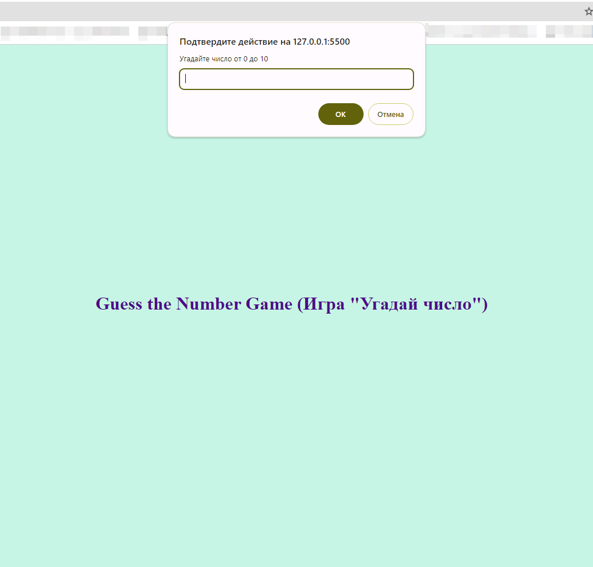
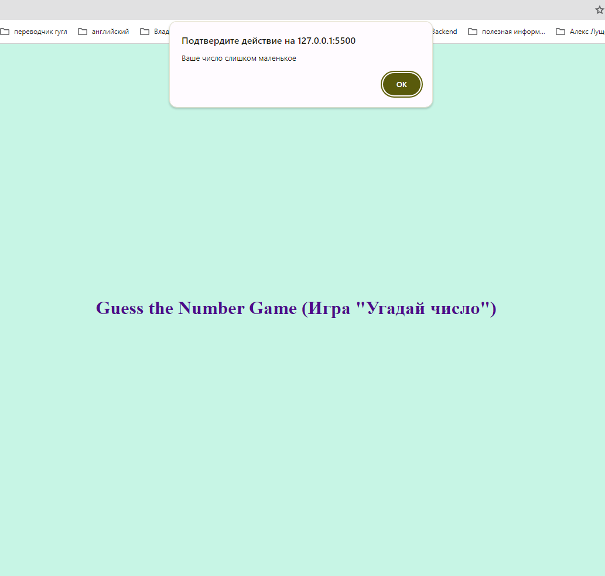
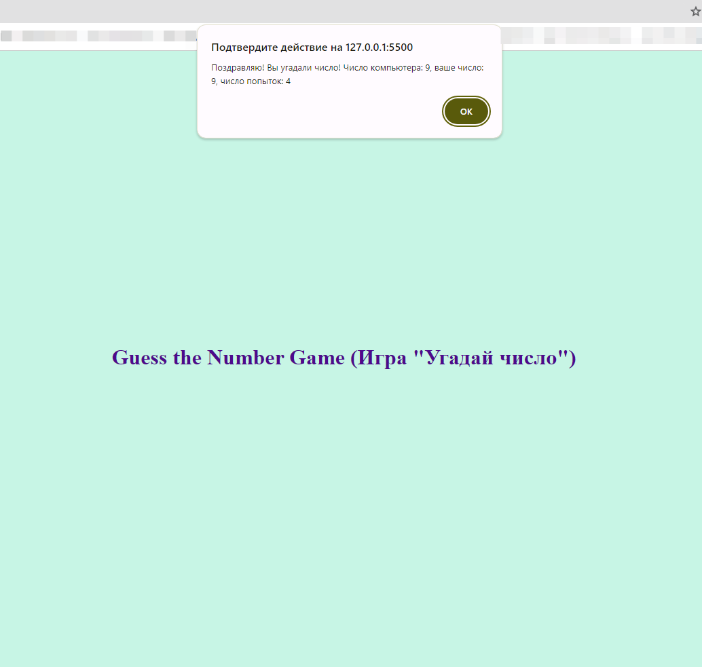

# Guess the number game (Игра "Угадай число")

## Description(RU) (Описание)
Скрипт предлагает пользователю отгадать выбранное им рандомное число от 0 до 10. 
Задача пользователя с наименьшим количеством попыток отгадать данное число.
Поиграть можно перейдя по ссылке https://ivan-ust402.github.io/MP-game-quess/.

## Description(En)
The script asks the user to guess a random number from 0 to 10 that they have chosen.

The user's task is to guess the given number in the fewest attempts.

You can play by following the link https://ivan-ust402.github.io/MP-game-quess/.

## Technologies used
* JavaScript
* CSS
* HTML

## Visual display of the application's operation

**Picture 1.** Game start screen.

**Picture 2.** Game next screen.

**Picture 3.** Game end screen.
